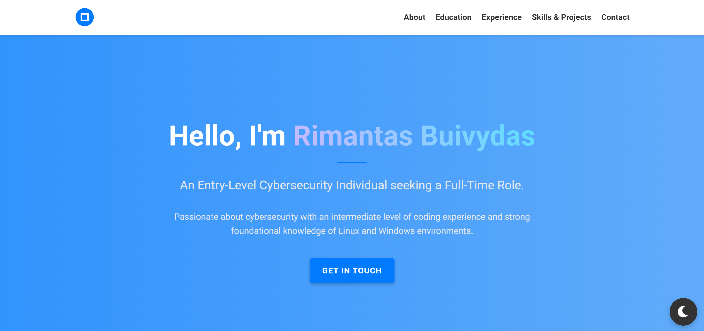

# Rimantas Buivydas - Portfolio Website

Welcome to my personal portfolio site! I'm an entry-level Cybersecurity graduate based in London, UK. This site showcases my background, technical skills, and projects, and is built with responsive, modern web technologies.

---

## 🌐 Live Site

🚀 Visit: [https://rbuivydas.github.io/](https://rbuivydas.github.io/)

---

## 📁 Features

- **Responsive Design** 
- **Collapsible Sections**
- **Dropdown Navigation**
- **Smooth Scrolling**
- **Profile Image**
- **Toggle Dark/Light Mode**

---

## 🛠 Tools

- HTML
- CSS
- JavaScript

---

## 📸 Preview

  

---

## 🔧 Installation

To run this project locally:

```bash
git clone https://github.com/<your-username>/<repository-name>.git
cd <repository-name>
